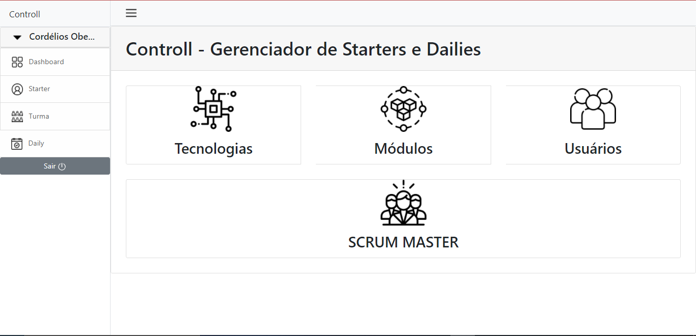
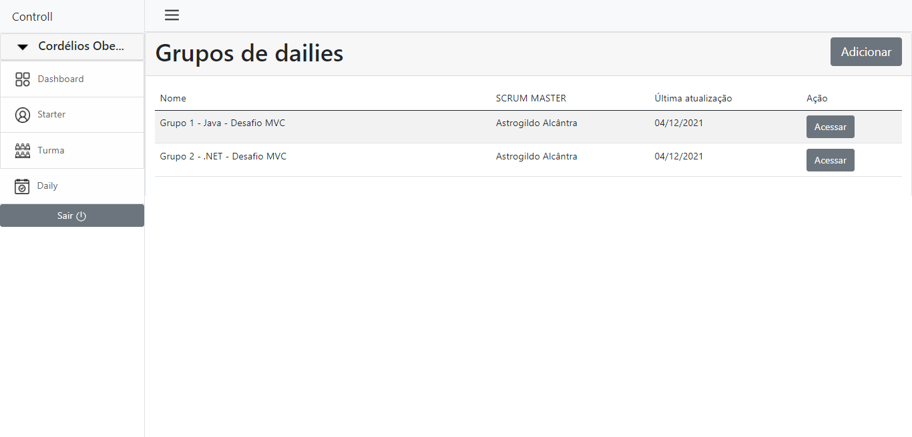
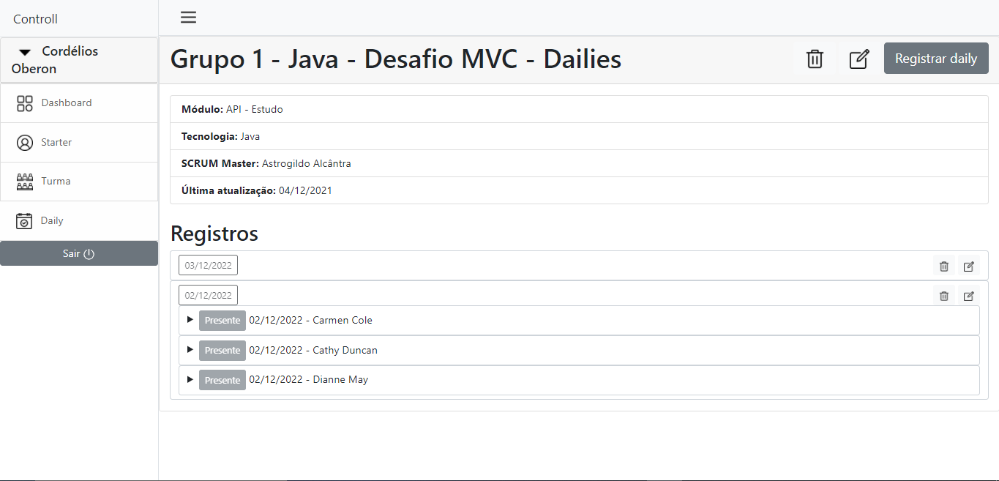
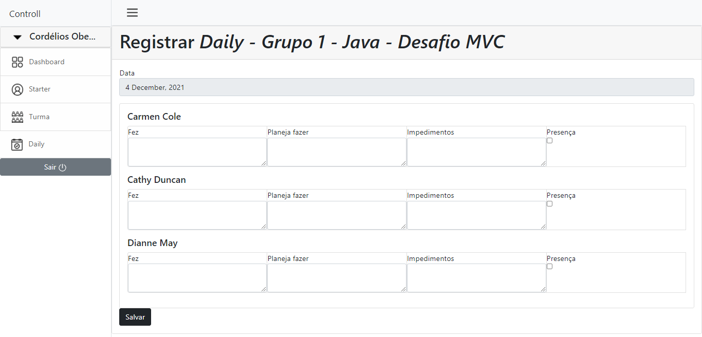
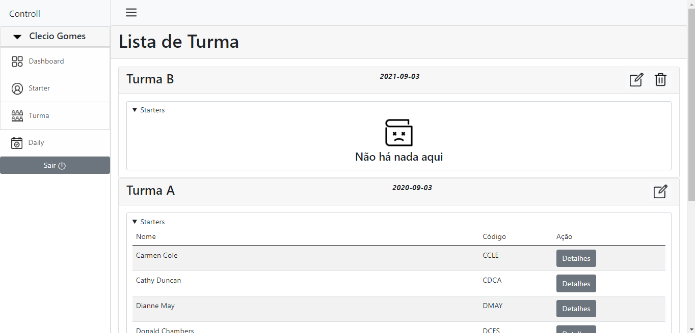

# Controll

## Ferramentas:
- :pushpin: Java 11
- :pushpin: Maven
- :pushpin: MariaDB 10.7

## Proposta
Criar um controle de Starter para GFT.

### Regras Gerais
- Popular banco: ou com botão ou assim que iniciar a aplicação.
- Criar CRUD para todas as entidades acima
- Validação de todos os campos
- Login Gerente com acesso a toda a Aplicação
- Login SM(Scrum Master) Acesso apenas as Dailys
- Pode acrescentar entidades se achar necessário, juntar, mas não pode eliminar
### Exceeds
- Cadastro de Empregado com foto.
- Criar um relatório mostrando quais Starters tem maior nota e menor nota.
- Enviar email automático para clecio.silva@gft.com sempre que um SM acessar a aplicação. (Neste caso sugiro criar um email fake para não ter que colocar senha de um email seu real)

## Screenshort

    
    
    
    
    
    

