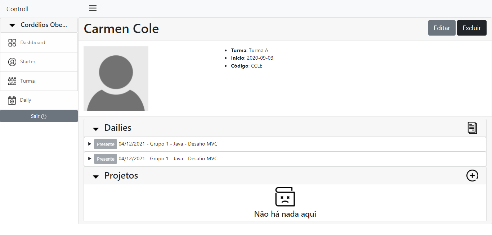
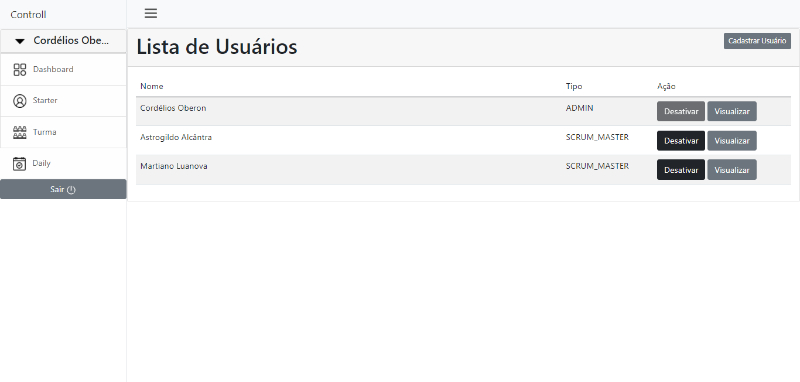

# Controll

## Ferramentas:
- :pushpin: Java 11
- :pushpin: Maven
- :pushpin: MariaDB 10.7


## Screenshot

<p align="center">
    
    
    
    
    
    
    
    
</p>

## :cd: Iniciar

Na linha de comando:
Use o ```mvnw``` para ambiente Linux e ```mvnw.cmd``` para Windows
```
./mvnw spring-boot:run
```

## Usuários:
- Cordélios Oberon
  - login: oberon-admin@sunny.com
  - senha: Lactea20NN
  - tipo: ADMIN

- Astrogildo Alcântra
    - login: astrogildo-scm@sunny.com
    - senha: Lactea20NN
    - tipo: SCRUM_MASTER

- Martiano Luanova
    - login: martiano-scm@sunny.com
    - senha: Lactea20NN
    - tipo: SCRUM_MASTER
  

### SGBD
Maria DB, com usuário ***root*** sem senha


